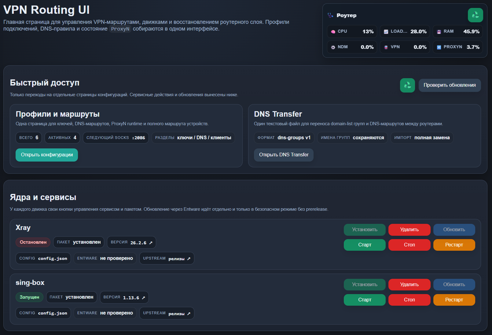
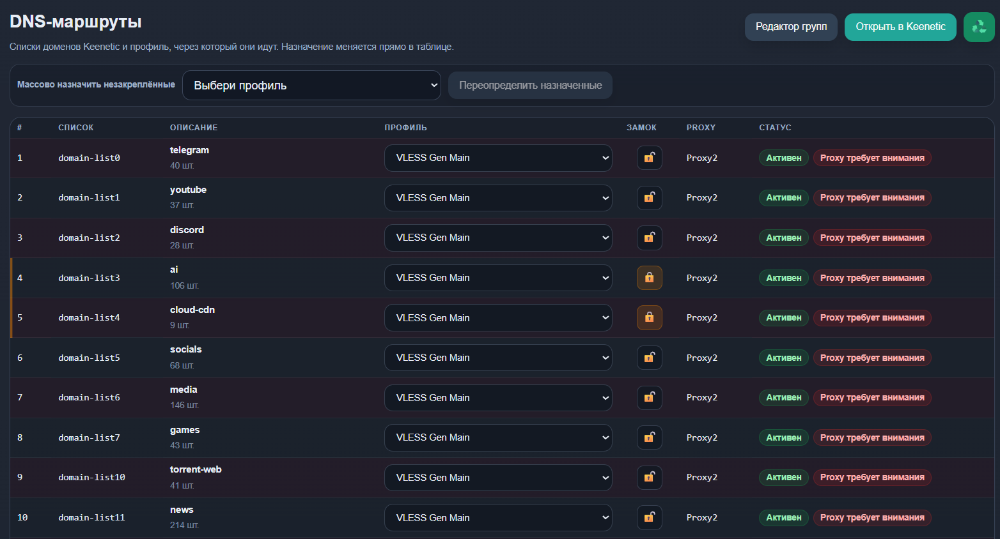
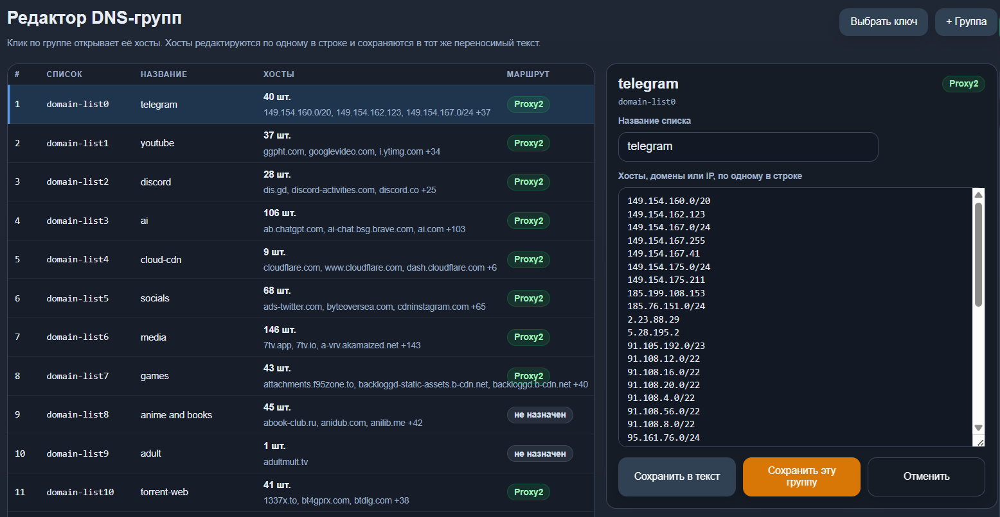

# VPN Routing UI

[](#требования)
[](#структура-проекта)

Лёгкий web-интерфейс для роутеров `Keenetic + Entware`: VPN-профили, DNS-маршруты, состояние `ProxyN`, управление `xray`/`sing-box` и быстрые действия восстановления в одном месте.

Проект сознательно не пытается быть тяжёлой серверной панелью. Из проектов вроде `3x-ui` здесь полезны идеи вокруг установки, статуса, бэкапов, скриншотов и безопасных обновлений, но runtime остаётся маленьким: статические страницы, shell CGI и обычные файлы состояния.

## Скриншоты







## Возможности

- Три лёгкие страницы: обзор, профили/маршруты и DNS-группы.
- Левый sidebar между страницами в стиле лёгкой панели и быстрые вкладки-якоря внутри страницы профилей.
- Управление сервисами `xray` и `sing-box` прямо из UI.
- Установка, удаление и безопасное обновление VPN-движков через Entware `opkg`.
- Защита от prerelease-обновлений и рискованных upstream-сборок.
- Хранение профилей в обычных файлах без SQLite/PostgreSQL и отдельного backend-демона.
- Импорт популярных proxy-ссылок и генерация конфигов для роутерного runtime.
- Live-состояние `ProxyN`, понятные причины проблем и кнопки сброса/рестарта.
- DNS `domain-list` маршрутизация в `ProxyN` или напрямую через ISP.
- Полный маршрут выбранного LAN-устройства через конкретный `ProxyN`.
- Backup `running-config` перед изменением DNS-маршрутов и client policy.
- Экспорт/импорт DNS-групп в формате `vpn-routing-ui dns-groups v1`.
- GitHub raw-file sync для переноса DNS-групп между роутерами.
- Виджет CPU/RAM/процессов для быстрой диагностики роутера.
- Даты последнего обновления UI и VPN-движков прямо на странице обзора.

## Быстрая установка

Перед установкой проверьте компоненты KeeneticOS. Это именно системные компоненты прошивки, не Entware-пакеты:

- `SSH server`
- `OPKG`
- `Proxy client`

`Proxy client` обязателен для `ProxyN`. Если его нет, Keenetic не принимает команды вида `interface Proxy0`, DNS-маршруты не смогут назначаться в профиль, а UI покажет ошибку про отсутствующий компонент `Proxy client`.

Выполнить на роутере от `root`:

```sh
wget -qO- https://raw.githubusercontent.com/sc113/vpn-routing-ui/main/install.sh | sh
```

Потом открыть:

```text
http://192.168.1.1:92/
```

Та же команда обновляет уже установленный интерфейс.

Если на роутере ещё нет HTTPS/cert-пакетов для скачивания с GitHub:

```sh
opkg update
opkg install ca-bundle wget-ssl
wget -qO- https://raw.githubusercontent.com/sc113/vpn-routing-ui/main/install.sh | sh
```

Вариант через `curl`:

```sh
curl -fsSL https://raw.githubusercontent.com/sc113/vpn-routing-ui/main/install.sh | sh
```

## Требования

- Keenetic OS с компонентами `SSH server`, `Proxy client`, `OPKG`.
- Entware в `/opt`.
- лёгкий web-server в `/opt`: предпочтительно `uhttpd`; если его нет в Entware-репозитории, installer использует fallback `lighttpd + mod_cgi + mod_setenv`.
- Для работы VPN-профилей:
  - `xray`
  - и/или `sing-box-go`

Installer попробует поставить отсутствующий web-server через `opkg`. VPN-движки можно поставить позже из самого интерфейса.

### Компоненты KeeneticOS

`Proxy client` устанавливается в веб-интерфейсе Keenetic: `Системные настройки` -> `Изменить набор компонентов` -> `Proxy client`. После изменения набора компонентов роутер может применить обновление прошивки и попросить перезагрузку.

Это не заменяется Entware-пакетами. `sing-box` и `xray` открывают локальные SOCKS-порты в `/opt`, а `Proxy client` даёт Keenetic системные интерфейсы `Proxy0`, `Proxy1`, ... и позволяет направлять в них DNS-группы и policy клиентов.

Если компонент отсутствует, типичный симптом:

```text
unsupported interface type: "Proxy"
```

В этом случае установите `Proxy client`, затем снова нажмите `Отправить на роутер`.

### Web-Сервер UI

Installer сначала пытается использовать `uhttpd`. На некоторых aarch64/новых Entware-репозиториях `uhttpd` может отсутствовать. Тогда автоматически ставится и настраивается:

```text
lighttpd + lighttpd-mod-cgi + lighttpd-mod-setenv
```

Порт UI остаётся тем же: `http://192.168.1.1:92/`, init-скрипт тоже один: `/opt/etc/init.d/S68vpn-routing-ui`.

## Лёгкий По Дизайну

Проект рассчитан на домашний Keenetic без лишней нагрузки:

- статические HTML/CSS/JS страницы через `uhttpd` или лёгкий `lighttpd` fallback;
- POSIX `sh` CGI вместо Go/Node/Python-сервиса;
- без Docker, systemd, базы данных, миграций и тяжёлого dashboard;
- без фонового polling за пределами открытого UI;
- состояние лежит в `/opt/etc/vpn-routing-ui`.

Главное отличие от `3x-ui`: `3x-ui` - полноценная серверная Xray-панель, а `VPN Routing UI` - маленькая роутерная панель политик, DNS-маршрутизации и восстановления Keenetic.

## Что Делает Installer

- Создаёт:
  - `/opt/share/vpn-routing-ui`
  - `/opt/share/vpn-routing-ui/cgi-bin`
  - `/opt/share/vpn-routing-ui/bin`
  - `/opt/etc/vpn-routing-ui`
  - `/opt/etc/vpn-routing-ui-runtime`
- Устанавливает Entware init-скрипты:
  - `S66vpn-routing-tune`
  - `S67vpn-routing-engine-guard`
  - `S68vpn-routing-ui`
- Запускает лёгкий web UI на порту `92`.
- Если `uhttpd` недоступен, поднимает совместимый `lighttpd` fallback с CGI.

Важные файлы состояния:

```text
/opt/etc/vpn-routing-ui/profiles.json
/opt/etc/vpn-routing-ui/dns-routes.state
/opt/etc/vpn-routing-ui/router-proxies.map
/opt/etc/vpn-routing-ui/backups/
```

## Ручная Установка Из Архива

Если raw-скачивание с GitHub неудобно, можно передать подготовленный пакет на роутер и выполнить:

```sh
cd /opt/tmp/vpn-routing-ui-share
sh install.sh
```

Если на роутере есть `git`, можно поставить прямо из исходников:

```sh
git clone https://github.com/sc113/vpn-routing-ui.git
cd vpn-routing-ui
sh install.sh
```

## Перенос DNS-групп

Страница DNS-групп экспортирует текущие Keenetic `domain-list` группы в текстовый формат `vpn-routing-ui dns-groups v1`.

Этот же текст можно импортировать обратно через `router-dns-text-sync.cgi`. Импорт добавляет или обновляет сами DNS-группы: описание и строки `include`.
DNS-маршруты, ProxyN и сохранённое состояние маршрутов при этом не меняются: новые группы добавляются без маршрута, а существующие назначения остаются как были. Перед применением сохраняется backup `running-config`.

Кнопка `Сохранить на роутер` во вкладке DNS-групп применяет весь файл сразу. Она должна сохранять все группы из списка, а не только первую. Поле route target в старых DNS-файлах считается legacy-полем и игнорируется: импорт DNS-групп не создаёт, не удаляет и не меняет маршруты в `ProxyN`.

## DNS-Маршруты

DNS-маршруты назначаются во вкладке `Профили` -> `DNS-маршруты`.

- `Переопределить незакреплённые` применяет выбранный профиль или прямое подключение ко всем DNS-группам без замка.
- Группы с включённым замком массовое переопределение не меняет.
- Назначение сохраняется на роутер только кнопкой `Отправить на роутер`.
- При сохранении UI сначала записывает config `sing-box`/`xray`, перезапускает нужные движки, затем создаёт/обновляет `ProxyN`, и только после этого применяет DNS-маршруты.

Такой порядок важен на новой установке: локальные SOCKS-порты должны уже слушать, иначе Keenetic не сможет корректно поднять `ProxyN`.

## Полный Маршрут Устройств

Вкладка `Полный маршрут устройств` назначает отдельному LAN-клиенту Keenetic `ip policy`, которая отправляет весь трафик клиента через выбранный `ProxyN`.

Список клиентов читается через локальный RCI endpoint Keenetic:

```text
http://127.0.0.1:79/rci/show/ip/hotspot/host
```

CGI использует `curl`, если он установлен, или `wget`, если `curl` отсутствует. Если RCI по какой-то причине пустой, UI строит запасной список из `ip hotspot` в `running-config` и `ip neigh`.

## Диагностика

Полезные быстрые проверки на роутере:

```sh
/opt/etc/init.d/S68vpn-routing-ui status
/opt/etc/init.d/S99sing-box status
netstat -lnt | grep ':208'
ndmc -c 'show running-config' | grep '^interface Proxy'
ndmc -c 'show running-config' | grep '^route object-group domain-list'
```

CPU в виджете состояния берётся из Keenetic control-plane (`ndmc -c "show system"`, поле `cpuload`), а не из коротких выборок `top`. Это даёт одинаковую шкалу на mips и aarch64 и ближе к графику штатной прошивки.

Дата обновления UI пишется installer-ом в `/opt/etc/vpn-routing-ui/versions.state`. Даты Xray и sing-box берутся из Entware `opkg status` (`Installed-Time`), поэтому показывают время установки или последнего обновления пакета через opkg.

## Безопасность

UI рассчитан на доверенную локальную сеть или доступ через SSH/VPN. Не публикуйте порт `92` в интернет.

Для удалённого доступа лучше использовать:

- VPN/WireGuard внутрь сети роутера;
- SSH tunnel до `192.168.1.1:92`;
- правила firewall в Keenetic, ограничивающие доступ к UI.

## Что Перенять У 3x-ui

Стоит держать или добавить в лёгком виде:

- установку/обновление одной командой из GitHub;
- понятный release-пакет с checksum;
- видимый статус версий движков и безопасных обновлений;
- ручной backup/export bundle для профилей, DNS-маршрутов и maps;
- on-demand обновление `geosite.dat`/`geoip.dat` только для движков, которым это нужно;
- компактную диагностику логов и сервисов;
- UI-настройку listen address/port.

Не стоит копировать на слабые роутеры:

- database backends;
- Docker deployment;
- Telegram bot и тяжёлые notification jobs;
- ACME/TLS management внутри панели;
- multi-user серверные функции, которые дублируют доступы Keenetic.

## Структура Проекта

- `shell/www/` - статический HTML/CSS/JS интерфейс.
- `shell/cgi/` - router API через маленькие CGI-скрипты.
- `shell/router/` - Entware init/helper-скрипты.
- `install.sh` - установка напрямую из GitHub или source checkout.
- `docs/screenshots/` - скриншоты для README.

## Удаление

```sh
/opt/etc/init.d/S68vpn-routing-ui stop
rm -f /opt/etc/init.d/S66vpn-routing-tune
rm -f /opt/etc/init.d/S67vpn-routing-engine-guard
rm -f /opt/etc/init.d/S68vpn-routing-ui
rm -rf /opt/share/vpn-routing-ui
```

Чтобы сохранить профили, состояние маршрутов и backup-файлы, не удаляйте:

```text
/opt/etc/vpn-routing-ui
```
